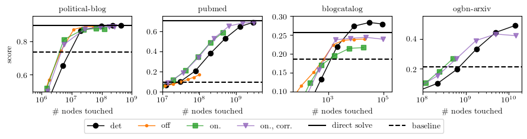
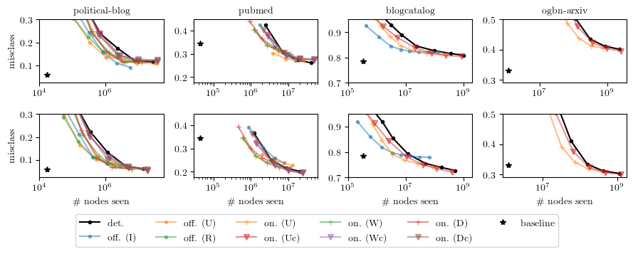

# GraphSubsampledAPPR

This repository contains the official implementation of the method described in our paper:

**Fast online node labeling with graph subsampling**  
Yushen Huang, Ertai Luo, Reza Babenezhad, Yifan Sun
arXiv: [link to paper] **TBD**

**[Read the paper here](LINK_TO_PAPER)**

---

## Abstract

Large data applications rely on storing data in massive, sparse graphs with millions to trillions of nodes. Graph-based methods, such as node prediction, aim for computational efficiency regardless of graph size. Techniques like localized approximate personalized page rank (APPR) solve sparse linear systems with complexity independent of graph size, but is in terms of the maximum node degree, which can be much larger in practice than the average node degree for real-world large graphs. In this paper, we consider an \emph{online subsampled APPR method}, where messages are intentionally dropped at random.   We use tools from graph sparsifiers and matrix linear algebra to give approximation bounds on  the graph's spectral properties ($O(1/\epsilon^2)$ edges), and    node classification performance (added $O(n\epsilon)$ overhead).

## Features

- **Online subsampling of high-degree nodes** to improve scalability on massive graphs
- **Dual correction mechanism** to stabilize the solution despite subsampling noise
- **Provable convergence rates** including \( O(1/T) \) and linear convergence in expectation
- **Supports both supervised and unsupervised tasks**, including online node labeling and graph clustering
- **Integration-ready** with existing APPR-based pipelines
- Includes scripts for comparing variants: baseline APPR, uniform/resistive/influencer sparsification, and dual correction

--- 

## Results

<p align="center">
  
</p>
<p align="center"><em>Figure 1: Performance of different variants of APPR on online node labeling. Lower is better.</em></p>

<br/>

<p align="center">
  
</p>
<p align="center"><em>Figure 2: Clustering performance with node embeddings generated via subsampled APPR. Higher is better.</em></p>


## Citation

If you use this code or build on this work, please cite:

```bibtex
@article{huang2025graphsubsampled,
  title={Fast online node labeling with graph subsampling},
  author={Huang, Yushen and Luo, Ertai and Babenezhad, Reza and Sun, Yifan},
  journal={arXiv preprint arXiv:TBD},
  year={2025}
}
```


## Contact
Yifan Sun : yifan.0.sun@gmail.com


